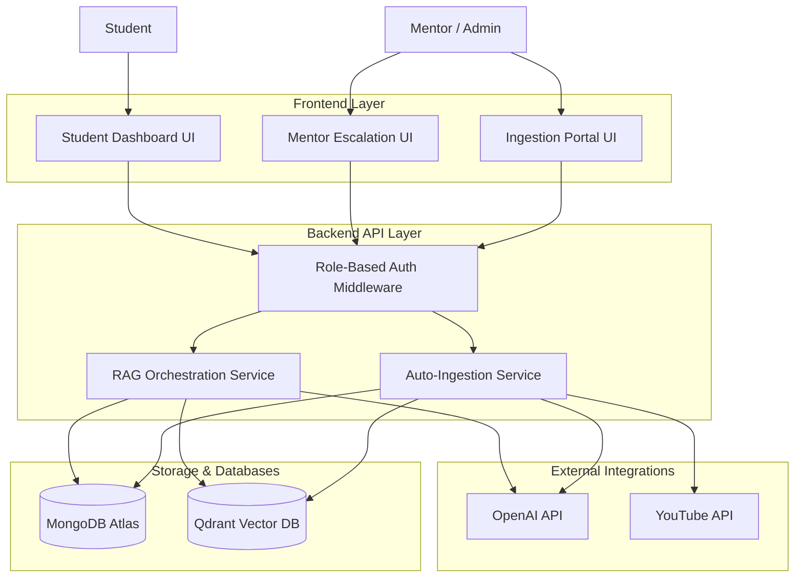
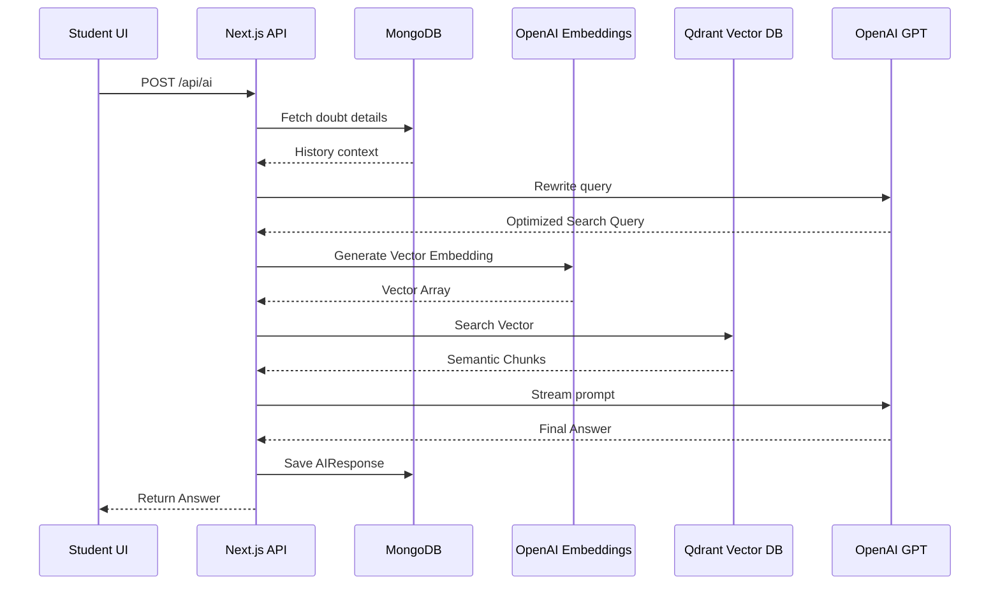
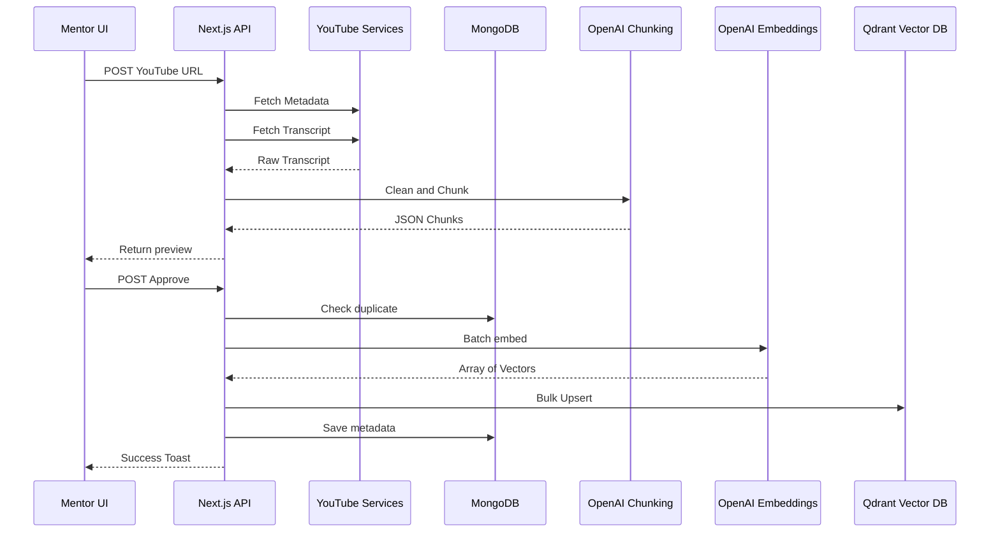
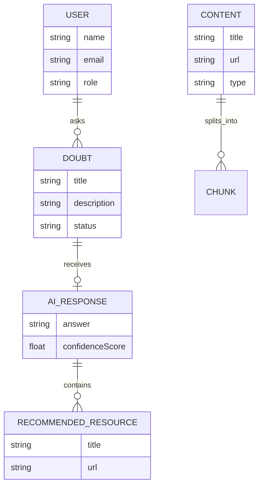
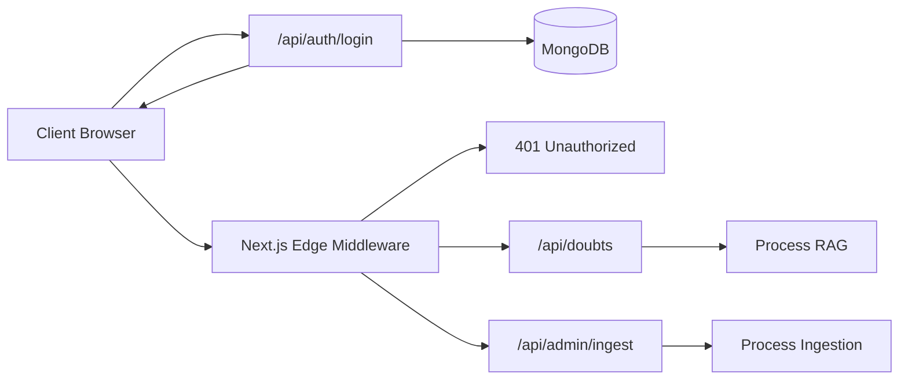

# System Architecture Diagrams

This document contains the visual representations of the High-Level Design (HLD) and Low-Level Design (LLD) of the House of EdTech RAG Platform.

## 1. High-Level Design (HLD)

This diagram outlines the macro-level architecture of the platform, detailing how the primary actors interact with the core systems and external integrations.

---

## 2. Low-Level Design (LLD) - RAG Retrieval Pipeline

This sequence diagram explains the exact chronological flow of how a student's doubt is processed, contextualized, and resolved using the RAG pipeline.

---

## 3. Low-Level Design (LLD) - Auto-Ingestion Pipeline

This flow illustrates the automated process of converting a raw YouTube lecture into highly optimized, timestamp-aware vector points.

---

## 4. Entity Relationship Diagram (ERD) - Database Schema

This diagram shows the relationship between the core collections in MongoDB and how they map to the Vector Database.

---

## 5. Security & Authentication Flow

This diagram outlines how the Edge Middleware protects the backend API routes and how JWT HTTP-Only cookies are processed.

