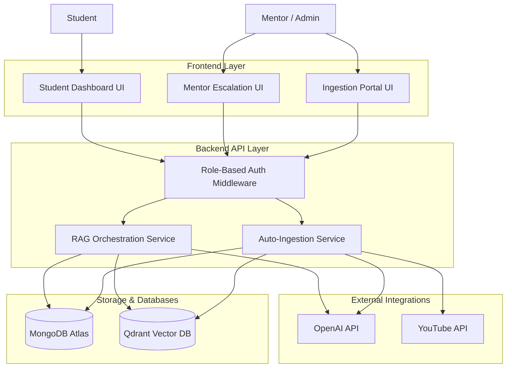
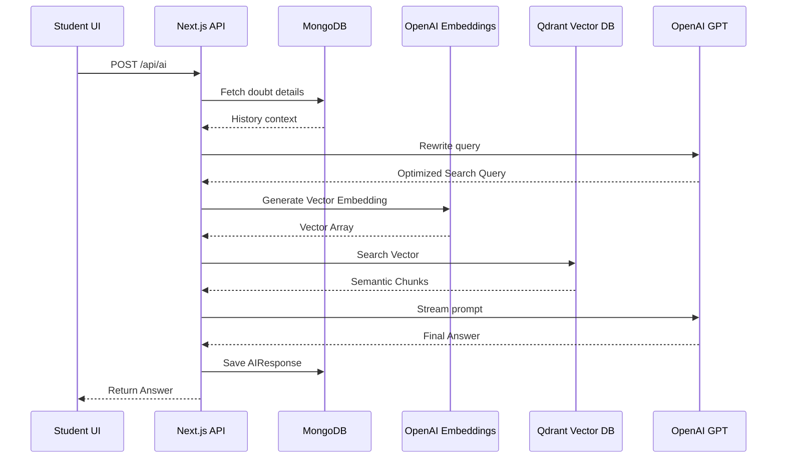
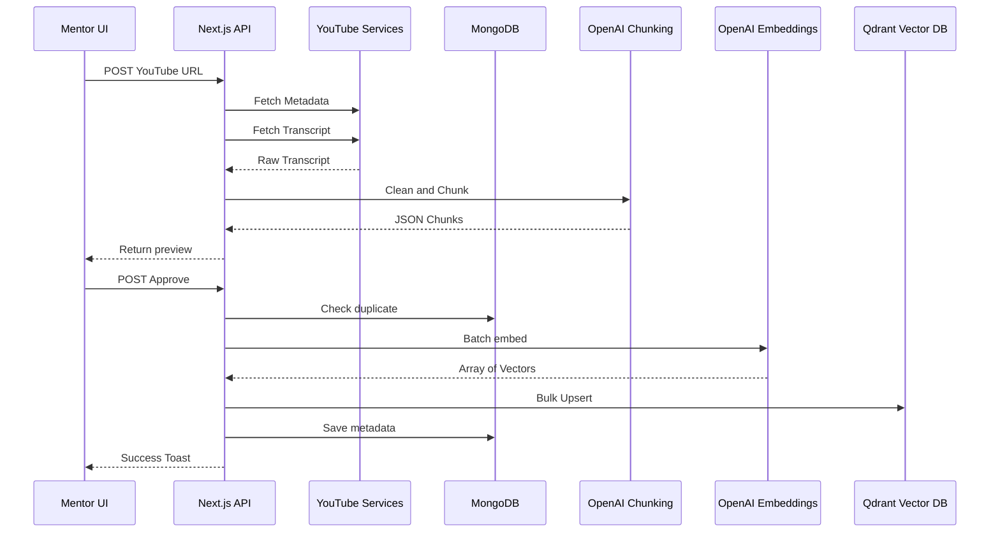
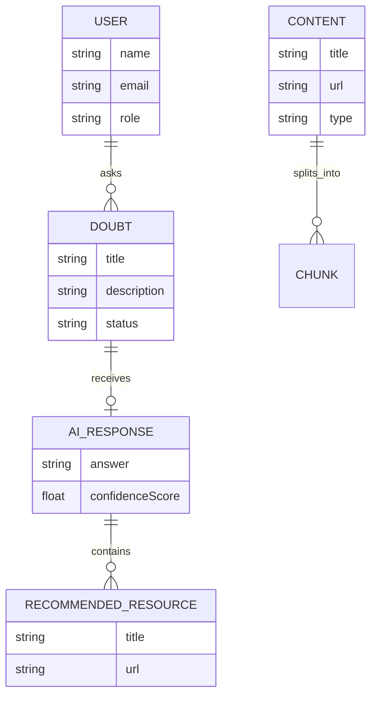

# House of EdTech - AI RAG Platform

## 👨‍💻 Demo Credentials
**Explore the platform instantly using these built-in accounts:**

| Role | Email | Password |
| :--- | :--- | :--- |
| **Student** | `demostudent@gmail.com` | `Demo@12345` |
| **Mentor / Admin** | `demomentor@gmail.com` | `Demo@12345` |

---

## 🌟 Project Overview
**House of EdTech** is a production-grade, AI-powered Educational RAG (Retrieval-Augmented Generation) Platform designed to eradicate the "doubt-resolution bottleneck" in modern learning environments. 

By leveraging **Retrieval-Augmented Generation**, this platform instantly resolves student doubts by performing semantic searches across course materials—including YouTube lecture transcripts, PDF notes, and documentation.

### Why Educational RAG?
Traditional LMS systems force students to wait hours or days for human replies. This platform understands your specific course context, allowing students to get context-aware answers in seconds, deep-linked directly to the relevant lecture moment.

### Core Capabilities
*   **Timestamp-Aware Video Retrieval:** Deep-link students directly to the exact second a concept is taught.
*   **Intelligent Auto-Ingestion:** Automated pipelines to clean transcripts and group content by educational concepts.
*   **Human-in-the-Loop Escalation:** High-confidence AI answers with seamless fallback to human mentors.
*   **Proactive Knowledge Gap Detection:** Dashboard tracking for frequently escalated topics.

---

## 🏗️ Architecture & Design

### High-Level Design (HLD)




### RAG Retrieval Pipeline (LLD)




### Automated Ingestion Workflow




---

## 📊 Database Schema (ERD)


---

## 🛠️ Technical Implementation

### Folder Structure
```text
/app
  /(dashboard)     # Protected routes (Student/Mentor)
  /api             # Backend REST endpoints
/components        # Reusable React UI (ChatUI, RecommendationList, Footer)
/lib               # Core singletons (mongodb.ts, qdrant.ts, openai.ts)
/services          # Business logic (rag.service.ts, ingestion.service.ts)
/models            # Mongoose schemas (Doubt, AIResponse, Content)
/types             # Global TypeScript definitions
```

### Chunk Schema (Qdrant Payload)
```typescript
{
  title: string;           // Resource title
  content: string;         // Semantic text chunk
  url?: string;            // Deep-link URL
  type: ResourceType;      // "video" | "article" | "pdf_notes"
  startTime?: string;      // Video offset (e.g., "1:24")
  endTime?: string;        // End offset
  videoId?: string;        // YouTube ID
  thumbnailUrl?: string;   // Visual asset
}
```

---

## 🚀 Quick Start & Installation

### 1. Clone & Install
```bash
git clone https://github.com/vidyaSagarMehar/house-of-edtech.git
cd house-of-edtech
npm install
```

### 2. Environment Variables (.env.local)
```env
JWT_SECRET=your_secret_key
MONGODB_URI=your_mongodb_uri
OPENAI_API_KEY=your_openai_key
QDRANT_URL=your_qdrant_url
QDRANT_API_KEY=your_qdrant_key
```

### 3. Run Development Server
```bash
npm run dev
```

---

## 🛡️ Security & Performance
*   **JWT HTTP-Only Cookies:** Mitigates XSS attacks.
*   **RBAC Middleware:** Protects admin/mentor routes.
*   **Batch Embeddings:** Optimized OpenAI API usage during ingestion.
*   **Semantic Query Rewriting:** Enhances retrieval accuracy by contextualizing queries with chat history.

---

## 🛣️ Future Roadmap
1.  **Multilingual Ingestion:** Translating transcripts into English for universal search.
2.  **Adaptive Learning:** Adjusting AI vocabulary based on student level.
3.  **Reranking Layer:** Implementing Cohere rerankers for ultra-precise retrieval.
4.  **Audio Search:** Whisper integration for voice-based doubts.

---

Created by **Vidya Sagar Mehar**
[GitHub](https://github.com/vidyaSagarMehar/) | [LinkedIn](https://www.linkedin.com/in/vidyasagarmehar/)
