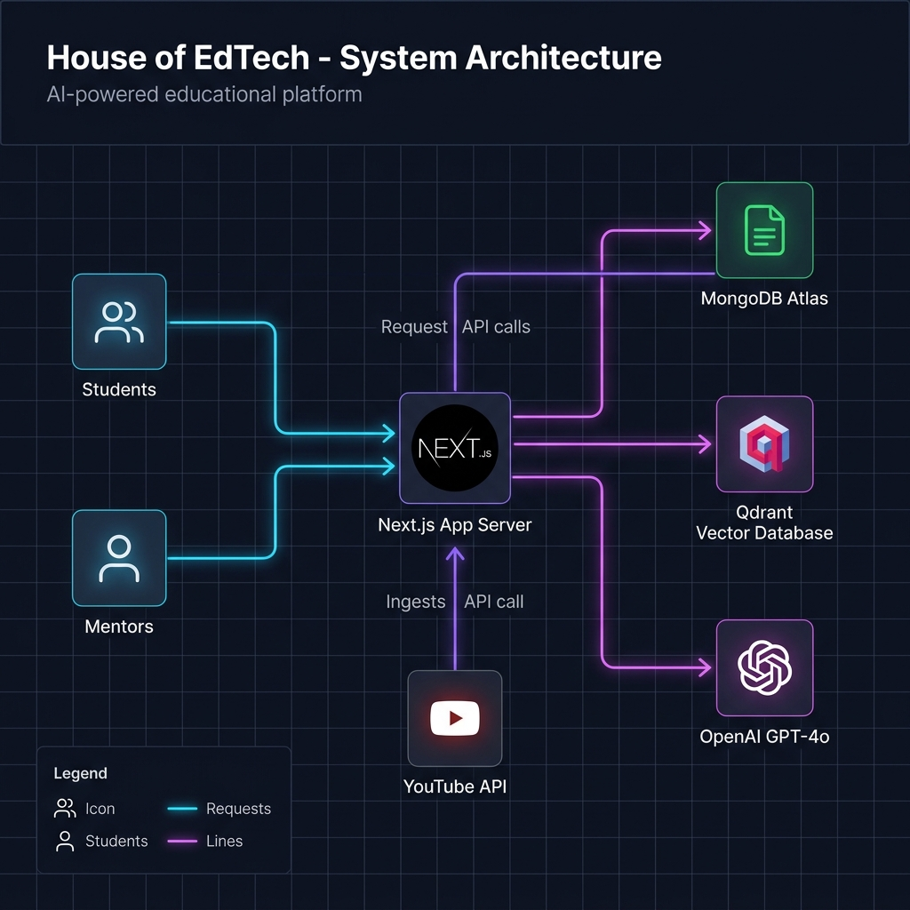
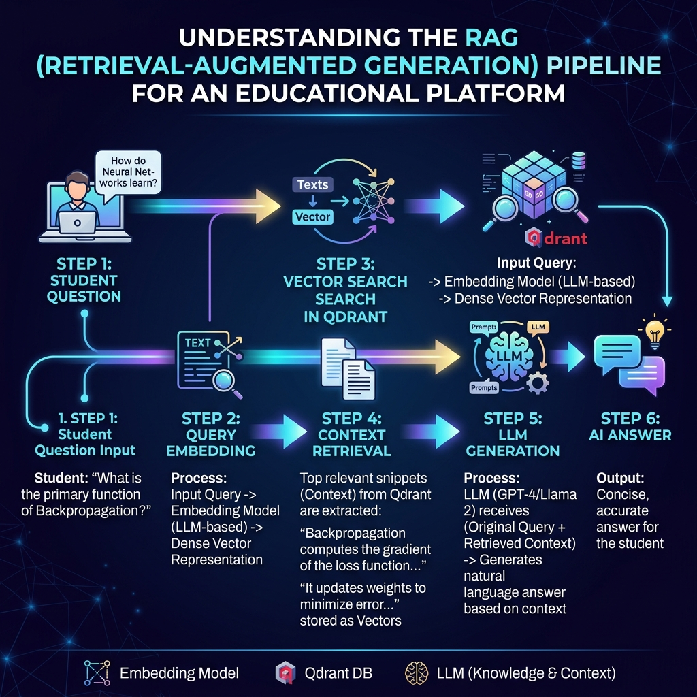
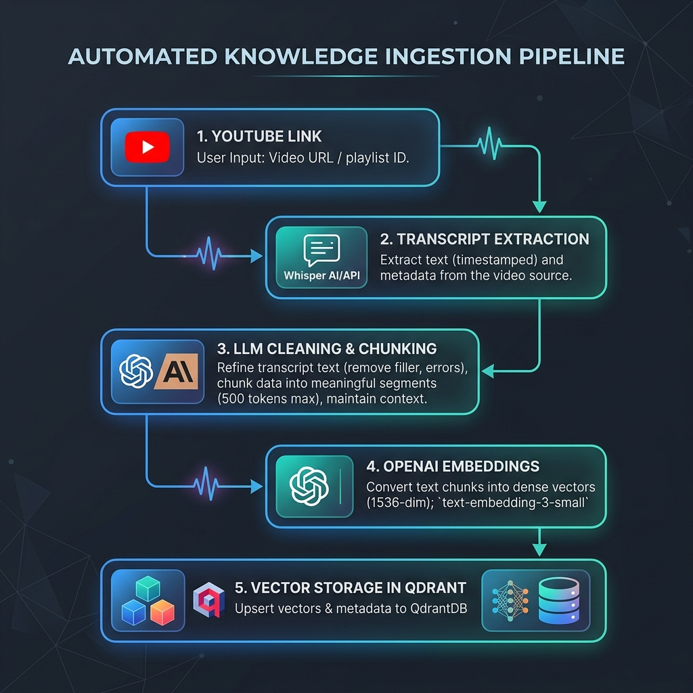

# House of EdTech - AI RAG Platform

## House of EdTech

A production-grade, AI-powered Educational RAG (Retrieval-Augmented Generation) Platform designed to instantly resolve student doubts, provide intelligent timestamp-aware video recommendations, and allow mentors to seamlessly ingest course materials into a vector database.

## 🌟 Key Features

- **Semantic Doubt Resolution**: Students can ask complex technical questions and receive accurate, context-aware answers in seconds.
- **Auto YouTube Ingestion**: Mentors simply paste a YouTube URL. The system automatically fetches the metadata, parses the transcript, cleans the noise using GPT-4o-mini, semantically chunks the concepts, and embeds them into Qdrant.
- **Timestamp Deep-Linking**: AI recommendations intelligently parse the start and end times of video chunks, providing students with clickable UI cards that jump directly to the exact second a concept is taught.
- **Mentor Escalation System**: When the AI's confidence score drops or a student marks an answer as unhelpful, the system instantly escalates the doubt to a real human mentor.
- **Knowledge Gap Analytics**: Mentors have access to a specialized dashboard tracking the most frequently escalated topics, allowing them to proactively ingest missing curriculum.

## 🏗️ Architecture & Workflows

### System High-Level Design (HLD)


### RAG Retrieval Pipeline (LLD)


### Automated Ingestion Workflow


*(For a deep-dive into the raw schemas and technical specifications, please see the [SYSTEM_ARCHITECTURE.md](./SYSTEM_ARCHITECTURE.md) document).*

## 🚀 Quick Start & Installation

### Prerequisites
- Node.js (v18+)
- MongoDB instance (Atlas or local)
- Qdrant instance (Cloud or Docker)
- OpenAI API Key

### 1. Clone & Install
```bash
git clone https://github.com/your-username/house-of-edtech.git
cd house-of-edtech
npm install
```

### 2. Environment Variables
Create a `.env.local` file in the root directory:
```env
# Authentication
JWT_SECRET=your_super_secret_jwt_key_32_chars

# MongoDB
MONGODB_URI=mongodb+srv://<user>:<password>@cluster0.mongodb.net/ai-doubt-system?retryWrites=true&w=majority

# OpenAI
OPENAI_API_KEY=sk-your-openai-key

# Qdrant Vector Database
QDRANT_URL=https://your-cluster-url.qdrant.tech:6333
QDRANT_API_KEY=your_qdrant_api_key
```

### 3. Run Development Server
```bash
npm run dev
```
Visit `http://localhost:3000`.

---

## 👨‍💻 Demo Credentials

To explore the platform, you can use the following built-in demo accounts:

**Student Account:**
- **Email:** demostudent@gmail.com
- **Password:** Demo@12345

**Mentor / Admin Account:**
- **Email:** demomentor@gmail.com
- **Password:** Demo@12345

---

## ⚙️ Workflows

### 1. Ingestion Workflow (Mentor)
1. Log in as a Mentor.
2. Navigate to **Ingest Knowledge**.
3. Select the **YouTube Auto-Ingest** tab.
4. Paste a YouTube URL (e.g., `https://youtube.com/watch?v=...`) and click **Fetch & Analyze**.
5. The system fetches the video metadata, scrapes the transcript, and uses GPT-4o-mini to segment it into timestamped, noise-free semantic chunks.
6. Review the generated chunks in the UI and click **Approve & Embed**.
7. The system dynamically batches the embeddings and bulk-upserts them into Qdrant.

### 2. AI Chat Workflow (Student)
1. Log in as a Student.
2. Type a question like *"Explain let vs const in JavaScript."*
3. The RAG Orchestrator pulls the conversation history and rewrites the query for semantic optimization.
4. The backend queries **Qdrant** for the top 5 most relevant semantic chunks.
5. The context is streamed to GPT-4o-mini to generate an accurate answer.
6. The UI dynamically maps the retrieved Qdrant payloads into beautiful Recommendation Cards, deep-linking the video thumbnail and exact timestamp.

---

## ☁️ Deployment

### Vercel (Recommended)
1. Push your code to GitHub.
2. Import the project in Vercel.
3. Add your `.env.local` variables in the Vercel Dashboard.
4. Click **Deploy**.

### Docker
A `Dockerfile` is provided for containerized deployment:
```bash
docker build -t house-of-edtech .
docker run -p 3000:3000 --env-file .env.local house-of-edtech
```

---

## 🛡️ Security
- **JWT HTTP-Only Cookies:** Used to completely mitigate XSS attacks during authentication.
- **RBAC Middleware:** Next.js Edge Middleware rigorously guards all `/api/admin` and `/mentor` routes.
- **Duplicate Prevention:** The ingestion pipeline automatically queries MongoDB before executing costly OpenAI embedding batches to prevent redundant API usage and vector poisoning.

