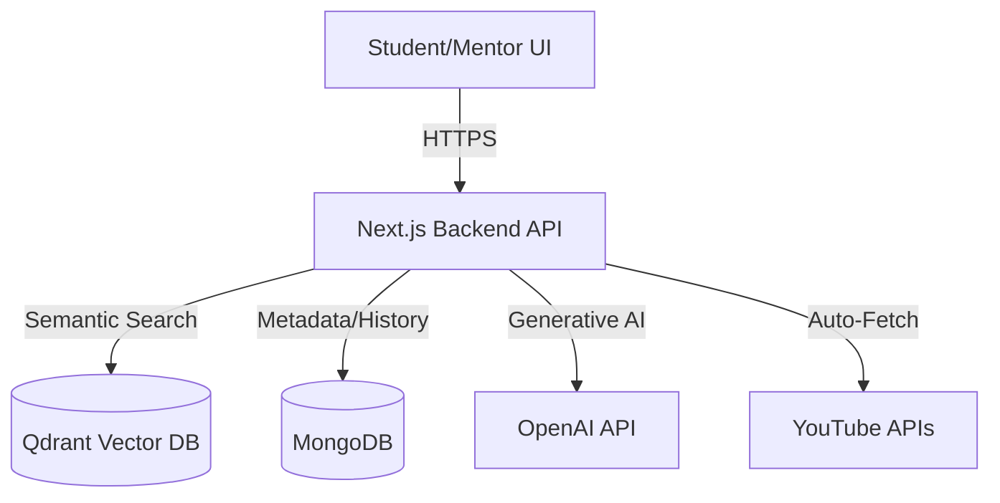
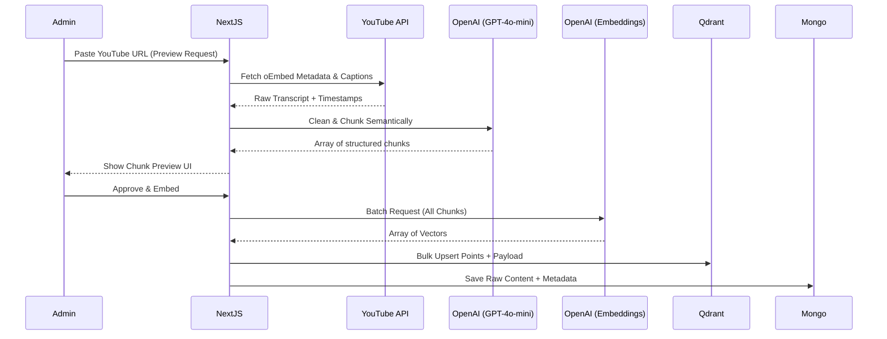

# System Architecture & Technical Design Document

## 1. Project Overview
**House of EdTech** is a next-generation, AI-powered educational platform designed to eradicate the "doubt-resolution bottleneck" in modern learning environments. Traditional Learning Management Systems (LMS) force students to pause their learning, submit a question to a forum, and wait hours or days for a teaching assistant to reply. 

By leveraging **Retrieval-Augmented Generation (RAG)**, this platform instantly resolves student doubts by performing semantic searches across course materials—including YouTube lecture transcripts, PDF notes, and documentation.

### Core Capabilities
*   **Timestamp-Aware Video Retrieval:** Ingests YouTube URLs, automatically extracts transcripts, performs semantic chunking, and provides AI answers that deep-link students directly to the exact second a concept is taught.
*   **Intelligent Auto-Ingestion:** Built-in automated pipelines to clean transcripts, remove noise (e.g., "[Music]", "Like and subscribe"), and group content by educational concepts rather than arbitrary character counts.
*   **Human-in-the-Loop Escalation:** If the AI tutor's confidence score drops below a threshold or a student marks an answer as unhelpful, the doubt is instantly escalated to a human mentor's dashboard.
*   **Proactive Knowledge Gap Detection:** Analytics dashboard identifies frequently escalated topics, prompting mentors to ingest missing materials.

---

## 2. High Level Design (HLD)

### Overall Architecture
The platform follows a modern Serverless Web Architecture, utilizing Next.js for both frontend rendering and backend API orchestration.



### System Components
1.  **Frontend Interface (Next.js / React / Tailwind):** A responsive, dark-mode optimized dashboard for chatting with the AI, reviewing escalated doubts, and ingesting new knowledge.
2.  **RAG Orchestrator (Node.js):** The central nervous system that takes a student's doubt, contextualizes it using chat history, retrieves context from Qdrant, and streams a prompt to GPT-4o-mini.
3.  **Knowledge Ingestion Engine:** Asynchronously processes raw URLs and files into clean, vector-ready embeddings.
4.  **Vector Store (Qdrant):** Optimized for high-speed cosine similarity searches across millions of transcript chunks.
5.  **Relational Store (MongoDB):** Maintains user profiles, raw unchunked transcripts, doubt statuses, and conversation histories.

---

## 3. Low Level Design (LLD)

### Folder Structure
```text
/app
  /(dashboard)     # Protected routes (Student/Mentor)
  /api             # Backend REST endpoints (/api/ai, /api/doubts, /api/admin/ingest)
/components        # Reusable React UI (ChatUI, RecommendationList, DashboardHeader)
/lib               # Core singletons (mongodb.ts, qdrant.ts, openai.ts, auth.ts)
/services          # Business logic (rag.service.ts, ingestion.service.ts, chunking.service.ts)
/models            # Mongoose schemas (Doubt, AIResponse, Content)
/types             # Global TypeScript definitions
```

### Core Services
*   `chunking.service.ts`: Uses a specialized LLM prompt to map raw transcript strings (with timestamps) into coherent, 300-700 character semantic concepts.
*   `ingestion.service.ts`: Orchestrates the flow from URL input -> transcript fetch -> chunking -> batch embedding -> Qdrant upsert -> MongoDB save.
*   `rag.service.ts`: Handles query rewriting (injecting conversation history), vector search, and final AI response generation.

### Chunk Schema (Vector Payload Structure)
When a document is chunked and embedded, the Qdrant payload looks like this:
```typescript
{
  title: string;           // E.g., "Intro to React Hooks"
  content: string;         // The cleaned text chunk
  url?: string;            // Base URL
  type: ResourceType;      // "video" | "pdf_notes" | "article"
  tags: string[];          // ["react", "frontend"]
  topic?: string;          // Auto-generated topic concept
  startTime?: string;      // "1:24"
  endTime?: string;        // "2:05"
  chunkIndex: number;      // 3
  videoId?: string;        // "papg2tsoFzg"
  channelName?: string;    // "Hitesh Choudhary"
  thumbnailUrl?: string;   // High-res YT thumbnail
}
```

---

## 4. System Design Details

### Scalability & Performance
*   **Horizontal Scaling:** Next.js API routes are deployed statelessly on Vercel/AWS Lambda, automatically scaling horizontally with traffic spikes.
*   **Batch Embeddings:** During ingestion, instead of hitting the OpenAI API 50 times for 50 chunks, the `ingestion.service.ts` batches all chunk strings into a single API call, massively reducing network I/O and rate limiting risks.
*   **Caching:** Static frontend assets are heavily cached via Vercel Edge Network. The system can be easily upgraded to cache frequent semantic queries using a Redis semantic caching layer.

### Hybrid Search Strategy
Currently utilizing Dense Vector Search via Qdrant (`text-embedding-3-small`). Future iterations are designed to introduce a Sparse Vector layer (BM25) to create a true Hybrid Search, allowing the system to perform well on exact keyword matches (e.g., specific variable names) as well as semantic concepts.

---

## 5. Ingestion System Design

The ingestion pipeline is the critical entry point for all platform knowledge.



**Duplicate Prevention:** Before any API calls, `ingestion.service.ts` checks MongoDB for existing `url` indices to prevent vector poisoning and redundant API costs.

---

## 6. RAG Pipeline Explanation

1.  **User Query:** Student asks, "Explain let vs var."
2.  **Contextualization:** The system retrieves the last 3 messages from MongoDB. An LLM rewrites the query into a standalone search string (e.g., "Differences between let and var variables in JavaScript").
3.  **Embedding:** The query is embedded via `text-embedding-3-small`.
4.  **Vector Search:** Qdrant returns the Top 5 closest chunks based on Cosine Similarity.
5.  **Context Assembly:** The backend constructs a prompt injecting the found `topics`, `timestamps`, and `content`.
6.  **AI Response:** GPT-4o-mini generates a concise, educational response.
7.  **Resource Recommendations:** The UI parses the Qdrant payloads, detects `startTime`, and dynamically renders hyperlinks like `https://youtube.com/watch?v=ID&t=124s` so the student can instantly jump to the lecture moment.

---

## 7. Database Design

### MongoDB Collections
*   **Users:** `name`, `email`, `password` (hashed), `role` (student | mentor).
*   **Doubts:** `userId`, `title`, `description`, `status` (open | resolved | escalated).
*   **AIResponses:** `doubtId`, `answer`, `confidenceScore`, `recommendedResources` (Array of source metadata schemas). *Note: The source schema explicitly preserves YouTube metadata to prevent Next.js HMR caching issues.*
*   **Contents:** `title`, `rawContent` (For audit/re-indexing), `url`, `type`, `chunks` (Array of sub-documents mapping to Qdrant IDs).

---

## 8. Authentication & Roles

Authentication is handled via custom JWT HTTP-Only Cookies to ensure maximum security against XSS attacks.

*   **Student:** Can create doubts, view AI responses, and provide feedback. Redirected to `/ask` upon login.
*   **Mentor/Admin:** Full access. Can view the escalation queue, monitor knowledge gaps via analytics, and ingest new URLs into the vector database via `/admin/ingest`.

**Demo Credentials:**
*   Student: `demostudent@gmail.com` / `Demo@12345`
*   Mentor: `demomentor@gmail.com` / `Demo@12345`

---

## 9. Security Considerations

*   **Prompt Injection:** The RAG prompt isolates the user query explicitly under a `Student Question:` boundary, instructing the AI to act only as a tutor.
*   **Rate Limiting:** Protects `/api/ai` endpoints to prevent malicious actors from burning OpenAI credits.
*   **Role-Based Access Control (RBAC):** Middleware heavily guards the `/api/admin` routes, instantly rejecting non-mentor JWTs.
*   **Vector Poisoning:** The UI allows Mentors to preview chunks *before* ingestion, ensuring no hallucinated or corrupted text enters the vector space.

---

## 10. Future Roadmap

1.  **Multilingual Ingestion:** Automatically translating Hindi/Spanish transcripts to English during the semantic chunking phase to create a universal knowledge base.
2.  **Adaptive Learning:** Storing a student's technical level in their MongoDB profile to dynamically adjust the complexity of the AI Tutor's vocabulary.
3.  **Reranking Layer (Cohere):** Implementing a Cross-Encoder reranker after Qdrant retrieval to push the most highly relevant chunks to the very top.
4.  **Audio Search:** Integrating Whisper to allow students to verbally ask questions on mobile devices.
